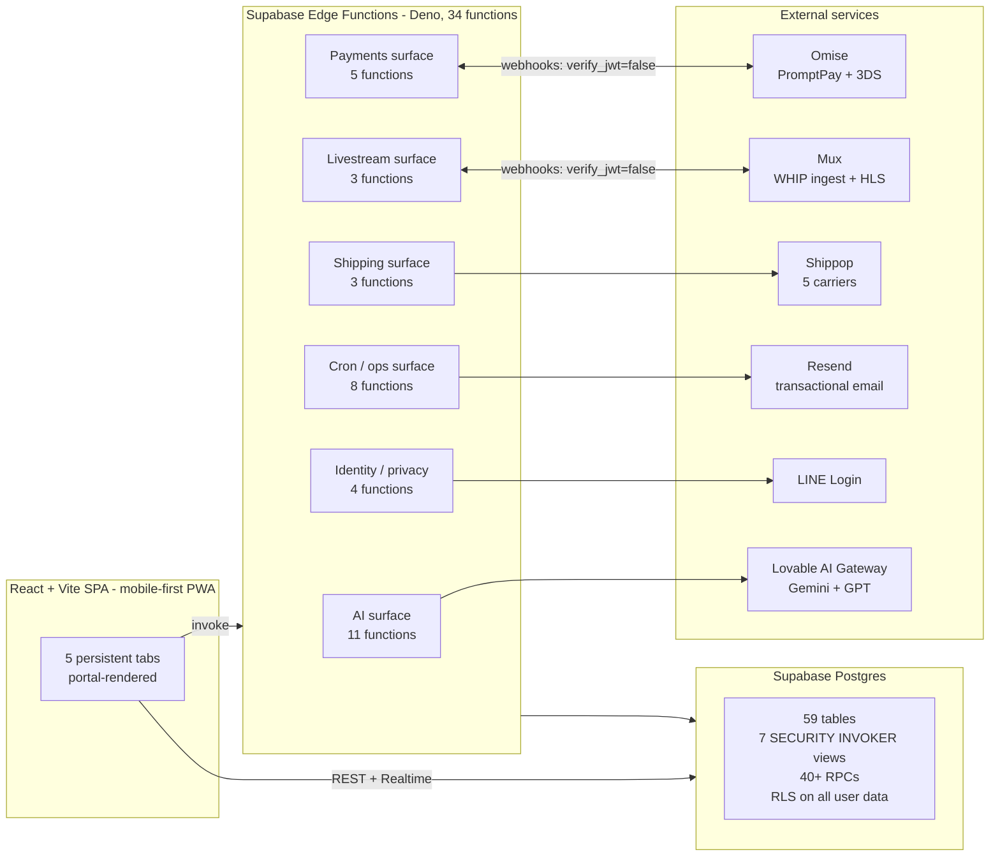

# ThriftTH - Engineering Case Study

A production two-sided secondhand fashion marketplace for the Thai market, built solo over ~4 months and running at **[thriftth.app](https://thriftth.app)**. This document is a technical retrospective, not a pitch. It describes what was built, why specific architectural choices were made, what broke in production, and which constraints shaped the design.

The application was authored using AI-assisted tooling (Lovable, Claude, Gemini, Cursor) by a non-traditional engineer. All architectural decisions, schema design, edge-function orchestration, debugging, and production cutover were owned end-to-end.

---

## 1. Problem framing

The Thai secondhand fashion market is large, informal, and overwhelmingly conducted through Facebook groups, LINE chats, and physical weekend markets (Chatuchak, Talad Rod Fai, etc.). Friction concentrates in a few well-defined places:

| Friction | Why it matters | Design response |
|---|---|---|
| Listing creation is manual and bilingual | Sellers post in mixed Thai/English; tourists and expats search in English; locals search in Thai | Server-side AI listing pipeline that produces both languages from photos |
| Payments are PromptPay-first, not card-first | ~90% of Thai consumer payments flow through PromptPay QR, not Visa/Mastercard | Omise integration with PromptPay as a first-class flow, card as secondary |
| Identity is LINE-first, not email-first | Email is rarely the primary identifier in TH; LINE is | Custom LINE OAuth edge function in addition to Supabase email auth |
| Trust is built socially, not by ratings | Buyers and sellers don't know each other; disputes are inevitable | Escrow + AI-triaged disputes + human-in-the-loop resolution |
| Live commerce is dominant in adjacent markets | TikTok Live and Facebook Live drive significant GMV in TH/SEA secondhand | First-party live auction subsystem with anti-snipe and server-authoritative closure |

Six months of field research preceded the build: ~30 vendor interviews and ~25 in-person demos across 35+ Bangkok weekend market visits, then a 25-vendor prototype cohort. The market research informed the schema (e.g., 27 fashion-specific categories enforced via DB check constraints), the fee model (5% + ฿25 flat, calibrated to typical ticket sizes), and the moderation posture (pre-submit AI gate, not post-hoc).

The system is live in beta with 30+ active users transacting on the platform.

---

## 2. System architecture



**Ingress posture.** Authenticated user actions go directly to Postgres via Supabase's REST/Realtime layer, gated by RLS. Anything requiring server-held secrets (AI keys, Omise secret key, Mux signing secret, Shippop credentials, ticket HMAC key) is funneled through edge functions. Third-party webhook endpoints (`omise-webhook`, `mux-webhook`) deploy with `verify_jwt = false` and verify their own provider signatures in-function - this is configured explicitly in `supabase/config.toml`.

**No backend service of our own.** There is no Node server, no Render container, no Kubernetes. The entire backend surface is Postgres + ~34 Deno edge functions. This was a deliberate operational simplification: one runtime, one auth model, one deployment surface, one observability stream.

---

## 3. Data model

59 tables grouped by domain. The schema is normalized; denormalization is intentional only where it serves a specific correctness or performance goal (e.g., address **snapshot** on `orders` so a later edit to the shipping address can't rewrite history).

| Domain | Key tables |
|---|---|
| Identity & access | `profiles`, `profiles_public` (view), `user_roles`, `admin_users`, `identity_verifications`, `banned_users`, `blocked_users` |
| Listings | `listings`, `listing_images`, `likes`, `watchers`, `saved_searches`, `content_policies`, `moderation_logs` |
| Commerce | `orders`, `offers`, `addresses`, `payment_methods`, `refunds`, `reviews`, `reports`, `disputes` |
| Auctions | `auctions`, `bids`, `pre_bids`, `active_auctions_feed` (view), `ending_soon_auctions` (view), `bid_history` (view), `seller_auction_dashboard` (view) |
| Livestream | `livestreams`, `livestream_items`, `livestream_reminders`, `live_chat_messages`, `live_now_feed`, `upcoming_lives_feed`, `replay_streams` |
| Ticketing (events) | `events`, `event_interest`, `ticket_tiers`, `tickets`, `ticket_orders`, `ticket_order_items`, `ticket_transfers`, `ticket_check_ins`, `promo_codes`, `promo_code_uses` |
| Economy | `points_transactions`, `balance_transactions`, `rewards`, `user_rewards`, `badges`, `user_badges`, `referrals`, `seller_payouts`, `seller_payout_methods` |
| Messaging | `chats`, `messages`, `message_rate_limits`, `notifications`, `notification_preferences` |
| Support | `support_conversations`, `support_messages`, `help_articles` |
| Platform | `platform_settings`, `analytics_events`, `admin_logs` |

**Security posture.**
- RLS is on for every user-facing table. Roles live in a separate `user_roles` table with a `has_role(user_id, role)` `SECURITY DEFINER` helper - never on `profiles` - to prevent the recursive-RLS and privilege-escalation traps that come from storing roles next to user data.
- All seven public views use `WITH (security_invoker = on)` so they inherit the caller's RLS context instead of running as the view owner. This is enforced as a project convention because Supabase views default to `security_definer`, which silently bypasses RLS.
- Cross-table atomic operations (point deduction, wallet deduction, reward redemption, bid placement, offer acceptance, withdrawal, referral completion) are implemented as Postgres functions (`deduct_points_atomic`, `place_bid`, `accept_offer_exclusive`, `process_seller_withdrawal`, etc.) so concurrency is handled in the database, not in the client.
- Known security debt is tracked explicitly (see §13).

---

## 4. AI orchestration

All runtime AI calls go through the **Lovable AI Gateway** (`ai.gateway.lovable.dev`), a single OpenAI-compatible endpoint that fronts Gemini and GPT families. The key (`LOVABLE_API_KEY`) is held server-side; the client never sees it and never sees a prompt. This means prompt changes are a server deploy, not a client release, and prompt history is bounded to the edge-function source.

**Model routing.** Models are chosen per task on a cost / latency / capability axis, not per provider preference:

| Edge function | Model | Why |
|---|---|---|
| `parse-search-intent` | `gemini-2.5-flash-lite` | High-volume, latency-sensitive, structured tool output only - cheapest tier wins |
| `moderate-listing` | `gemini-2.5-flash-lite` | Pre-submit gate; must be fast, structured-output, runs on every listing |
| `ai-help-assistant` | `gemini-2.5-flash-lite` | Customer-facing chat with intent classification; cost compounds |
| `analyze-dispute` | `gemini-2.5-flash-lite` | Structured recommendation only; reasoning quality less critical than schema adherence |
| `ai-listing-assist` | `gemini-3-flash-preview` | Multimodal vision + bilingual copywriting + price reasoning - needs a frontier-tier model |
| `enrich-listing` | `gemini-3-flash-preview` | Same multimodal demands as listing assist |
| `analyze-video-content` | `gemini-3-flash-preview` | Video understanding; flash-tier is the cost/quality sweet spot |
| `verify-identity` | `gemini-2.5-flash` | ID document OCR + face match; accuracy matters more than latency |
| `analyze-event-poster` | `gemini-2.5-flash-image-preview` | Image-native model for poster understanding |
| `translate-message` | `openai/gpt-4o-mini` | GPT-4o-mini outperformed Gemini Flash on short conversational TH↔EN with idiom |

**Structured output via tool calling, not JSON-mode-and-hope.** Every function that needs a typed payload (search filters, moderation verdict, dispute recommendation, listing metadata) declares an OpenAI-style `tools` schema and forces `tool_choice` to that function. JSON parsing is the fallback path, not the primary one - this eliminates the class of bugs where a model returns prose wrapped around JSON.

**Per-call fallback.** Translation, moderation, and search-intent all degrade gracefully: a 402/429/empty response falls back to the original text, an open moderation decision, or a literal substring search, respectively. The user never sees a hard failure from the AI layer.

**Prompt locality.** No prompt template lives in the React bundle. The frontend invokes a named function; the function owns the system prompt, the model selection, and the structured-output schema. This is the single most important governance choice in the project - it means prompts can be audited, versioned, and rolled back without touching the client.

---

## 5. Human-in-the-loop governance

The product makes a deliberate distinction between **decisions the model is allowed to make** and **decisions only a human can finalize**:

- **Moderation (`moderate-listing`)** - model can auto-reject obviously prohibited content (weapons, counterfeits, adult material). Borderline cases are surfaced to the admin queue with the model's rationale attached, never auto-published.
- **Identity verification (`verify-identity`)** - auto-approve only if Gemini's confidence is ≥ 85% on both document validity and face-match. Anything below that threshold goes to manual review. The threshold is a tunable, not a magic number.
- **Dispute triage (`ai-dispute-triage` + `analyze-dispute`)** - the model produces a structured recommendation: `refund_buyer | favor_seller | partial_refund | need_more_info`, with confidence, reasons, risk factors, and a suggested refund percentage. It **never** moves money. An admin reviews the recommendation and executes the action through a separate RPC.
- **Help assistant (`ai-help-assistant`)** - handles FAQ-shaped queries autonomously, but escalates to a human conversation the moment intent classification returns `complaint`, `refund_request`, `account_issue`, or low confidence.

This is the pattern that maps cleanly onto enterprise process redesign: **automate the throughput layer, gate the consequence layer.** The model compresses time-to-decision; the human owns the decision itself. The same design applies directly to any enterprise workflow where AI recommendations touch financial, legal, or compliance decisions - the confidence threshold and escalation path simply get tuned to the regulatory tolerance of the domain.

---

## 6. Payments and escrow

Omise was chosen over Stripe because Stripe doesn't have a meaningful Thai consumer presence - PromptPay QR is the dominant payment instrument and Omise treats it as a first-class flow.

**Flow.**
1. `process-payment` (card) or `create-promptpay-charge` (QR) - server-side charge creation against Omise. 3D Secure is handled server-side for cards.
2. `omise-webhook` - `verify_jwt = false`, but verifies the Omise webhook signature in-function. Idempotent: re-delivery is safe because order state transitions are guarded by check constraints (`pending → paid → shipped → delivered`).
3. Funds enter **escrow** on `paid`. The order's `platform_fee_total` is computed and frozen at checkout time using `5% + ฿25` (configurable via `platform_settings`, with cascading rules so admin fee changes apply to new checkouts and still-pending orders only).
4. `auto-release-escrow` (cron) releases funds to the seller's wallet 7 days after delivery confirmation, or immediately on buyer confirmation. Disputes opened within the 48-hour window after delivery pause the release.
5. `process-payout` and `process_seller_withdrawal` (RPC) handle the seller cash-out. Minimum withdrawal is ฿100.

**Payout formula** (single source of truth, enforced in the DB):
```
payout = total_amount − shipping_cost − platform_fee_total
```
All rounded to 2 decimals via `Math.round` to avoid floating-point drift in financial ledgers. `shipping_cost` and `platform_fee_total` default to `0` at the DB level so a missing value can never silently inflate a payout.

**Refunds (`process-refund`).** Restore wallet balance and points proportionally (points earned on the original transaction are clawed back at the same rate they were issued). Failed payouts route through `refund_failed_payout` to return funds to the seller's wallet without losing audit history.

---

## 7. Live commerce - the hardest production problem

The original goal was a TikTok-Live-style seller experience: browser-only broadcast, ~2s glass-to-glass latency, integrated auctions. Mux + WHIP (WebRTC-HTTP Ingestion Protocol) is the right primitive for this; the production headache came from how it interacts with Deno.

**The problem.** Browser-side WHIP requires the broadcaster to POST an SDP offer to a Mux endpoint and receive an SDP answer. Doing this from the browser directly exposes the Mux stream key. Routing through a Deno edge function looked obvious, but Deno's `fetch` and the Mux WHIP endpoint had several incompatibilities around content-type, ICE candidate timing, and PATCH semantics. The first cut would intermittently produce a 200 with a malformed SDP body.

**The fix.** A minimal Deno edge function (`whip-proxy/index.ts`, ~50 lines) that:
- Accepts `{ streamKey, sdpOffer }` from the authenticated client
- Forwards the offer to `https://global-live.mux.com/api/v1/whip/<streamKey>` with `Content-Type: application/sdp`
- Returns the answer SDP back to the client as JSON

This keeps the stream key server-side, avoids the PATCH-based trickle-ICE flow that was failing, and accepts a 5-second ICE-gathering window on the client before sending the offer (the "5s ICE limit" in the WHIP broadcasting spec). The earlier README claimed this was a Node service on Render - that was incorrect. The final architecture is pure Supabase edge functions; no second runtime.

**Auction integrity.** Auction closure is **server-authoritative**, not client-timer-driven. A client showing "0:00" doesn't end the auction; the Mux `video.live_stream.idle` webhook does. This eliminates the entire class of bugs where a buyer on a slow connection sees a different end time than the seller, and prevents client-side clock manipulation. Bids inside the final 3 minutes extend the timer by 3 minutes (anti-snipe), matching standard auction-house behavior.

**Bid increments** are matched to a tiered schedule (฿10 minimum at low prices, scaling to ฿1,000 at high prices) enforced both in the `place_bid` RPC and in the UI, so a stale client can't submit a malformed bid.

---

## 8. Search and discovery

The search layer doesn't use Elasticsearch, Algolia, Meilisearch, or any dedicated engine. It uses Postgres + an AI intent parser, and the tradeoff was deliberate: one less moving piece, one less index to keep in sync with RLS, no additional egress surface.

**Pipeline.**
1. User types a query (Thai, English, or mixed).
2. `parse-search-intent` (Gemini Flash Lite, ~200ms) returns a structured filter object via tool calling: `{ keywords, categories, color, size, brand, price_min, price_max, condition, sort }`.
3. The structured filter is composed into a Postgres query against `listings` with:
   - GIN index on a generated tsvector covering English + Thai title/description columns (stored as sibling columns `description` / `description_th`, not as a JSONB blob)
   - `pg_trgm` for fuzzy matching on brand and Thai script (which doesn't tokenize well with standard FTS)
   - Numeric filters applied directly
4. If the AI call fails or times out, fall back to a plain `ILIKE` over the bilingual columns - search degrades, never breaks.

**Why this works.** Most secondhand fashion queries are short and structured ("oversized black tee size L under 500"). Compressing them to structured filters once is dramatically more useful than pure-text ranking. The model becomes a query rewriter, not a ranker - and that's a job small models do very well at low cost.

---

## 9. Ticketing subsystem

Events with paid tickets are a separate vertical inside the same app (markets, popups, livestream-adjacent events). The interesting governance work here is in the QR code design:

- **HMAC-SHA256 signed payload.** Each ticket's `qr_payload` is a signed structure containing the ticket ID, order ID, and a nonce. The signing key (`TICKET_SIGNING_SECRET`) is in the edge-function environment for generation, and a `VITE_TICKET_SIGNING_SECRET` is in the client environment for **offline scanner verification** - door staff can validate signatures without a network round-trip.
- **Server-side redemption.** Signature validity ≠ redemption. The scanner still hits the DB to record a `ticket_check_ins` row, so a forged or replayed QR with a valid signature still gets caught.
- **15-minute inventory hold.** Tier reservations happen in `increment_ticket_tier_sold` (RPC). If the buyer doesn't complete payment in 15 minutes, the inventory is released back atomically. This prevents the cart-abandonment-as-DoS pattern that plagues smaller ticketing systems.
- **Transfers (`ticket_transfers`).** 48-hour expiry on transfer offers; accepting a transfer regenerates the QR signature so the original holder's QR is invalidated.

---

## 10. Operational surface

There are eight scheduled edge functions handling background work:

| Function | Cadence | Purpose |
|---|---|---|
| `auto-release-escrow` | hourly | Release escrowed funds 7 days post-delivery |
| `send-reminders` | hourly | Order action reminders, dispute deadlines |
| `expire-boosts` | hourly | End paid listing boosts at their TTL |
| `expire-points` | daily | Expire loyalty points 1 year after issuance |
| `send-expiry-warnings` | daily | 30 / 7 / 1 day warnings before point expiry |
| `award-badges` | daily | Recompute earned badges (first sale, 10-sale, etc.) |
| `cleanup-notifications` | daily | Prune read notifications older than 30 days |
| `generate-sitemap` | daily | Rebuild sitemap.xml for SEO |

This is the part of the system that most resembles enterprise operations work: idempotent jobs, defensive logging, partial-failure tolerance. None of them are allowed to leave the system in a worse state than they found it - every one of them is safe to re-run on the same input.

**Observability.** PostHog handles client analytics (`autocapture: false`, manual virtual pageview tracking - the app is a single-page PWA with custom routing, so default capture would be useless). Edge-function logs ship to Supabase's log pipeline. Errors in the client are wrapped in a React `ErrorBoundary` with telemetry; the boundary's failure mode is "show a recovery screen", not "white page".

---

## 11. Authentication and identity

Two auth flows coexist:

- **Supabase email auth** - primary. Configured with `detectSessionInUrl: false` and `flowType: 'implicit'` because Supabase's default email-link flow was breaking on iOS Safari in-app browsers (LINE, Facebook). A custom `/auth/callback` route extracts the hash fragment and hands it to `setSession` explicitly. This is documented in `mem://constraints/supabase-auth-config` as a deliberate deviation from defaults.
- **LINE OAuth** - custom edge function (`line-auth`). LINE is the dominant identity provider in Thailand. The function exchanges the LINE auth code for a profile, then either finds the matching Supabase user (by email, with a known O(n) lookup ceiling at 1,000 users - see §13) or provisions a new one.

Email verification is a hard gate: unverified accounts cannot create listings, send messages, or open chats. This is enforced in RLS, not just in the UI.

Password hardening: minimum 8 characters, leaked-password protection enabled via the Supabase dashboard (one of two known **manual config items** - the dashboard toggle has no Terraform/API equivalent).

---

## 12. Build process and AI tool orchestration

The implementation cadence used multiple AI tools, each with a defined role:

| Tool | Role |
|---|---|
| **Lovable** | Primary authoring environment. Component scaffolding, schema migrations, edge function generation, end-to-end iteration loop. Effectively the "engineering team". |
| **Claude (Sonnet/Opus)** | Architecture reasoning, RLS policy review, debugging stubborn production issues (the WHIP problem in particular), code review on Lovable-authored changes. |
| **Cursor** | Local IDE work for surgical multi-file edits where Lovable's request-scoped context was unhelpful. |
| **Gemini Pro** | Long-context reads when reasoning about the full schema or several edge functions at once. |
| **ChatGPT** | Quick utility work - transcribing voice notes from market research, drafting copy, naming things. |

**Important distinction.** None of the above are in the **runtime** of ThriftTH. The runtime AI surface is exclusively the Lovable AI Gateway (Gemini + GPT families). Claude/Cursor/ChatGPT were build-time engineering tools, not user-facing dependencies. This separation matters: the production system has one AI vendor relationship to govern, not four.

**On leading with AI tools.** Building solo with this stack is structurally similar to leading a small distributed team: you set the architecture, review generated output, course-correct when a tool produces something wrong, allocate the right tool to the right task, and own every tradeoff. The feedback loop is tighter than with human collaborators and the tools don't push back - but the decision-making pattern is the same. Direction setting, output review, course correction, and final accountability all sit with one person. That's the experience this build was designed to develop and demonstrate.

**Validation loop.** Pre-launch audits were run as discrete phases - financial logic, auth, search, payment, shipping - each with a checklist (the `docs/TRANSACTION_FLOW_TEST_CHECKLIST.md` and `docs/UX_TRANSACTION_FLOW_AUDIT.md` artifacts in the repo are the working evidence of this). The audits were treated as gates, not as documentation theater.

---

## 13. Honest limitations and known debt

A senior reviewer should see this section as the most important one. It's where credibility is earned.

| Item | Status | Notes |
|---|---|---|
| `profiles` view exposes `seller_balance` | **known, accepted** | Tracked in `mem://constraints/profiles-security-refactor`. Refactor scheduled; not a hot exploit because RLS bounds visibility to the row owner, but the column shouldn't be on the public view at all. |
| LINE auth lookup scans first 1,000 users only | **known, accepted** | Acceptable at current scale. Real fix is a unique index on `auth.users.line_id` once we backfill. |
| Livestream is feature-flagged off in beta | **intentional** | Gated behind a 10+ completed-sale threshold. Mux costs and WHIP-on-mobile-browser reliability aren't yet good enough for unrestricted access. |
| Supabase "leaked password" + OTP expiry toggles | **manual config** | Both must be enabled in the dashboard; no API/migration path exists. Documented in `mem://constraints/security-manual-config`. |
| Auction integrity depends on the Mux idle webhook | **acceptable** | If Mux is down, auction closure is delayed, not lost. A 6-hourly reconciliation cron is the next backstop. |
| No formal load testing yet | **honest gap** | The system has been validated functionally and on real cohorts, not against synthetic load. Postgres + RLS + ~50 RPCs is the obvious profiling target when load arrives. |
| Test mode PromptPay flows differ from prod | **known** | Test webhooks don't fire the same payload shape; documented in `mem://features/payments/promptpay-flow-v4`. |
| Mobile media OOM on low-RAM Android (≤2GB) | **mitigated, not solved** | Canvas operations capped at 2048×2048; image cropping skipped on low-RAM devices; uses `createObjectURL` over base64. |

---

## 14. What this project is evidence of
The architectural choices made throughout this solo build were designed to address the exact types of operational constraints encountered in large-scale enterprise environments:

Production-Grade Orchestration. The system moves past chat interfaces into a governed, multi-model pipeline. Using model-per-task routing based on cost, latency, and capability mirrors the exact infrastructure required to scale internal enterprise tools efficiently while managing API overhead.

Practical Workflow Redesign. Every AI integration was selected to compress process times, not to showcase technology. Turning a complex manual listing process into a 15-second automated flow follows the identical pattern needed to optimize high-friction corporate processes: automate the structured intake layer so professionals can focus entirely on validation.

Defensive Governance & Risk Mitigation. The build rejects total AI autonomy in favor of clear compliance boundaries. By separating throughput automation (moderation screening and dispute summaries) from consequential outcomes (moving escrowed funds or changing user status), the architecture provides a clean, auditable trail that fits perfectly into highly regulated environments like audit, tax, and legal advisory.

Full-Lifecycle Ownership. Managing this stack from initial market interviews and database schema design through API integrations, WebRTC debugging, and background cron stability demonstrates complete technical accountability. The core muscle developed here-interpreting messy operational needs, identifying the right tools, correcting course during technical roadblocks, and owning the production outcome-translates directly to leading human teams and technical initiatives within an enterprise AI lab.

Mapped, without spin, to the competencies relevant to an AI Builder role:

- **Agentic AI systems.** A live, governed multi-model pipeline with tool-calling structured output, model-per-task routing, and explicit fallback paths. The same routing and fallback patterns apply to enterprise agent builds where task decomposition, cost control, and graceful degradation are non-negotiable.

- **Workflow redesign.** Listing creation reduced from a multi-step manual flow to "upload photos, confirm". Search reduced from "filter through 8 dropdowns" to "type a sentence". Disputes reduced from "free-text email" to "structured triage with reviewer recommendation". Each redesign followed the same pattern: identify where human time is being spent on classification rather than judgment, and automate the classification layer.

- **Productionization.** 34 edge functions, 8 cron jobs, Omise/Mux/Shippop/LINE/Resend webhook surface, RLS-enforced multi-tenant data, idempotent payment state machine - with 30+ active beta users transacting on the live system.

- **Responsible AI thinking.** Pre-submit moderation, confidence-thresholded auto-approval, server-side prompt locality, human review on consequence decisions, transparent escalation paths. These aren't bolt-ons - they're structural. In a regulated enterprise context (audit, tax, advisory), the same design principle applies: the model recommends, the human decides, and the boundary between those two states is explicit and auditable.

- **Systems integration.** Five external SaaS surfaces (payments, video, shipping, identity, email) integrated with their respective webhook signature schemes, idempotency requirements, and failure modes. Enterprise environments typically involve more integration surfaces, not fewer - this is the relevant practice ground.

- **Ambiguity navigation.** Thai market constraints - PromptPay, LINE, bilingual content, mobile-first low-RAM Android - drove non-obvious architectural choices that wouldn't surface in a North American template. Operating in ambiguity without a playbook, and making defensible decisions under those conditions, is the transferable skill.

- **Technical leadership without a formal pedigree.** End-to-end ownership: market research → schema → edge functions → AI orchestration → payments → live commerce → production cutover → operational runbook. AI was the team; the judgment and accountability were mine. The same principles that governed this build - clear direction, structured output review, course correction on wrong turns, explicit tradeoffs - translate directly to leading a team of human builders.

---

## Contact

**Chris Rambihar**
[chris.rambihar@gmail.com](mailto:chris.rambihar@gmail.com) · [linkedin.com/in/chrisrambihar](https://linkedin.com/in/chrisrambihar)

Live: [thriftth.app](https://thriftth.app) · Code review available on request.
